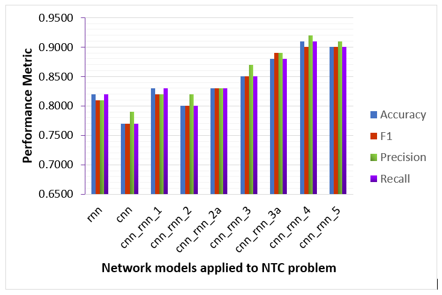

# network-traffic-classification

**This is work is based on**

*M. Lopez-Martin, B. Carro, A. Sanchez-Esguevillas and J. #Lloret, "Network Traffic Classifier With Convolutional andRecurrent Neural Networks for Internet of Things," in IEEE #Access, vol. 5, pp. 18042-18050, 2017.doi: 10.1109/ACCESS.2017.2747560*

**Abstract:** 
A network traffic classifier (NTC) is an important part of current network monitoring systems, being its task to infer the network service that is currently used by a communication flow (e.g., HTTP and SIP). The detection is based on a number of features associated with the communication flow, for example, source and destination ports and bytes transmitted per packet. NTC is important, because much information about a current network flow can be learned and anticipated just by knowing its network service (required latency, traffic volume, and possible duration). This is of particular interest for the management and monitoring of Internet of Things (IoT) networks, where NTC will help to segregate traffic and behavior of heterogeneous devices and services. In this paper, we present a new technique for NTC based on a combination of deep learning models that can be used for IoT traffic. We show that a recurrent neural network (RNN) combined with a convolutional neural network (CNN) provides best detection results. The natural domain for a CNN, which is image processing, has been extended to NTC in an easy and natural way. We show that the proposed method provides better detection results than alternative algorithms without requiring any feature engineering, which is usual when applying other models. A complete study is presented on several architectures that integrate a CNN and an RNN, including the impact of the features chosen and the length of the network flows used for training.

**URL:** *http://ieeexplore.ieee.org/stamp/stamp.jsp?tp=&arnumber=8026581&isnumber=7859429*

# result 

**Soon I will add my work on top of the paper :relieved: :thumbsup:** 
